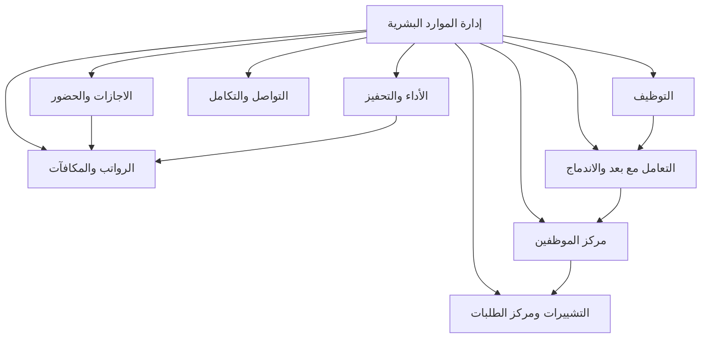

# هيكل وحدة الموارد البشرية - HR Module Structure

## 📂 البنية التنظيمية

تنقسم وحدة الموارد البشرية إلى قسمين رئيسيين:

### 1. قسم الإدارة (Admin)
الأدوات والصفحات المخصصة لإدارة الموارد البشرية والمديرين

### 2. قسم الموظف (Employee)
البوابة الذاتية للموظفين لإدارة شؤونهم الشخصية

---

## 📊 Admin Section - قسم الإدارة

```
hr/Admin/
├── employee-center/                            # مركز الموظفين
│   ├── overview.md
│   ├── employee-profile.md
│   ├── self-service-portal.md
│   ├── documents.md
│   └── reports.md
├── leaves-attendance/                          # الإجازات والحضور
│   ├── overview.md
│   ├── attendance-tracking.md
│   ├── leave-requests.md
│   ├── leave-balance.md
│   └── absence-management.md
├── salaries-rewards/                           # الرواتب والمكافآت
│   ├── overview.md
│   ├── salary-calculation.md
│   ├── allowances.md
│   └── bonuses.md
├── performance-motivation/                     # الأداء والتحفيز
│   ├── overview.md
│   ├── performance-evaluation.md
│   ├── kpis.md
│   ├── career-development.md
│   └── training-programs.md
├── communication-integration/                  # التواصل والتكامل
│   ├── overview.md
│   ├── internal-announcements.md
│   ├── employee-messaging.md
│   └── system-integration.md
├── recruitment/                                # التوظيف
│   ├── overview.md
│   ├── job-postings.md
│   ├── applicant-tracking.md
│   ├── interviews.md
│   └── hiring-decisions.md
├── post-recruitment/                           # ما بعد التوظيف
│   ├── overview.md
│   ├── onboarding-program.md
│   ├── orientation.md
│   └── probation-period.md
└── changes-requests/                           # التغييرات والطلبات
    ├── overview.md
    ├── employee-data-changes.md
    ├── transfers-promotions.md
    └── approvals.md
```

---

## 👤 Employee Section - قسم الموظف

```
hr/Employee/
├── my-profile/                                 # ملفي الشخصي
│   └── overview.md
├── my-leaves/                                  # إجازاتي
│   └── overview.md
├── my-attendance/                              # حضوري وانصرافي
│   └── overview.md
├── my-salary/                                  # راتبي
│   └── overview.md
├── my-requests/                                # طلباتي
│   └── overview.md
└── my-documents/                               # مستنداتي
    └── overview.md
```

---

## 🔄 العلاقة بين القسمين

### Admin → Employee
- **إدارة البيانات**: الإدارة تدخل وتحدث بيانات الموظفين
- **الموافقات**: الإدارة تعتمد طلبات الموظفين
- **التقارير**: الإدارة تنشئ تقارير من بيانات الموظفين
- **الإشعارات**: الإدارة ترسل إشعارات للموظفين

### Employee → Admin
- **الطلبات**: الموظفون يقدمون طلبات للإدارة
- **التحديثات**: الموظفون يحدثون بياناتهم الشخصية
- **التقارير**: الموظفون يبلغون عن المشاكل
- **الاستفسارات**: الموظفون يتواصلون مع الإدارة

---

## 🎯 الصفحات المشتركة

بعض الوظائف موجودة في القسمين بطرق مختلفة:

| الوظيفة | Admin | Employee |
|---------|-------|----------|
| **الإجازات** | إدارة إجازات جميع الموظفين | إجازاتي الشخصية فقط |
| **الحضور** | مراقبة حضور جميع الموظفين | سجل حضوري فقط |
| **الراتب** | إدارة رواتب جميع الموظفين | كشف راتبي فقط |
| **الطلبات** | مراجعة واعتماد الطلبات | إنشاء ومتابعة طلباتي |
| **المستندات** | إدارة مستندات جميع الموظفين | مستنداتي الشخصية |
| **الملف الشخصي** | عرض وتعديل ملفات الموظفين | عرض وتحديث ملفي |

---

## 🔐 الصلاحيات

### الموظف (Employee)
- ✅ الوصول الكامل لبياناته الشخصية
- ✅ طلب الإجازات والشهادات
- ✅ عرض راتبه ومستنداته
- ✅ تحديث معلوماته الشخصية
- ❌ الوصول لبيانات موظفين آخرين
- ❌ اعتماد الطلبات

### المدير المباشر (Line Manager)
- ✅ عرض بيانات المرؤوسين
- ✅ اعتماد طلبات الإجازات
- ✅ تقييم أداء المرؤوسين
- ✅ عرض ملخص رواتب المرؤوسين
- ❌ تعديل الرواتب
- ❌ الوصول لبيانات موظفين خارج فريقه

### الموارد البشرية (HR)
- ✅ الوصول الكامل لجميع البيانات
- ✅ إدارة جميع الموظفين
- ✅ اعتماد جميع الطلبات
- ✅ إصدار الشهادات
- ✅ إدارة الرواتب والمكافآت
- ✅ التوظيف والفصل

### الإدارة المالية (Finance)
- ✅ عرض البيانات المالية
- ✅ إعداد وصرف الرواتب
- ✅ اعتماد القروض والسلف
- ❌ تعديل البيانات الشخصية

---

## 🚀 سير العمل الموحد

### مثال: طلب إجازة

1. **الموظف** (Employee Section):
   - يقدم طلب إجازة من صفحة "إجازاتي"
   - يتابع حالة الطلب

2. **المدير** (Admin Section):
   - يستلم إشعار بالطلب
   - يراجع الطلب في "التغييرات والطلبات"
   - يوافق أو يرفض

3. **الموارد البشرية** (Admin Section):
   - تستلم إشعار بالموافقة
   - تعتمد الطلب نهائياً
   - يتم تحديث رصيد الإجازات تلقائياً

4. **النظام**:
   - يرسل إشعار للموظف بالاعتماد
   - يحدث نظام الحضور
   - يرسل تذكير قبل موعد الإجازة

---

## 📱 واجهة المستخدم

### Admin Interface
- تصميم شامل مع جداول وتقارير مفصلة
- لوحات تحكم تحليلية
- أدوات إدارة متقدمة
- عرض بيانات متعددة الموظفين

### Employee Interface
- تصميم بسيط وسهل الاستخدام
- بطاقات ومعلومات شخصية
- إجراءات سريعة ومباشرة
- عرض البيانات الشخصية فقط

---

## 🔗 التكامل مع الأنظمة الأخرى

كلا القسمين (Admin و Employee) يتكاملان مع:
- نظام المحاسبة
- نظام الحضور والانصراف
- النظام البنكي
- نظام الإشعارات
- نظام الوثائق والأرشفة
    ├── incentive-system.md
    └── professional-development.md
```

---

## 📋 المكونات الرئيسية

### 1. الرواتب والمكافآت (`/hr/salaries-rewards`)
- حساب الرواتب الشهرية
- إدارة البدلات
- الحوافز والمكافآت
- سجل المرتبات

### 2. التشييرات ومركز الطلبات (`/hr/changes-requests`)
- طلبات تغيير البيانات
- النقل والترقية
- متابعة الطلبات
- الموافقات

### 3. التعامل مع بعد والاندماج (`/hr/post-recruitment`)
- برامج التأهيل
- إجراءات الانضمام
- التوجيه والإرشاد
- فترة التجربة

### 4. التوظيف (`/hr/recruitment`)
- الوظائف الشاغرة
- استقبال الطلبات
- فحص المتقدمين
- المقابلات
- قرارات التوظيف

### 5. الاجازات والحضور (`/hr/leaves-attendance`)
- الحضور والانصراف
- طلبات الإجازات
- رصيد الإجازات
- التقارير الزمنية
- الغياب والتأخير

### 6. التواصل والتكامل (`/hr/communication-integration`)
- الإعلانات الداخلية
- رسائل الموظفين
- التكامل مع الأنظمة
- المستندات المشتركة

### 7. مركز الموظفين (`/hr/employee-center`)
- الملف الشخصي
- بيانات الراتب
- طلب الخدمات
- المستندات
- التقارير الذاتية

### 8. الأداء والتحفيز (`/hr/performance-motivation`)
- تقييم الأداء
- مؤشرات الأداء (KPIs)
- نظام الحوافز
- برامج التحفيز
- التطوير المهني

---

## 🔗 الروابط بين المكونات



---

## 🎯 أولويات التطوير

### المرحلة الأولى (الأساسيات)
1. ✅ الصفحة الرئيسية
2. ⏳ مركز الموظفين (بيانات أساسية)
3. ⏳ الاجازات والحضور
4. ⏳ الرواتب الأساسية

### المرحلة الثانية (التوسع)
5. ⏳ التوظيف
6. ⏳ التشييرات ومركز الطلبات
7. ⏳ التواصل والتكامل

### المرحلة الثالثة (المتقدمة)
8. ⏳ الأداء والتحفيز
9. ⏳ التعامل مع بعد والاندماج
10. ⏳ التقارير المتقدمة

---

## 📊 العلاقات مع الوحدات الأخرى

### مع المحاسبة (`/accounting`)
- ربط الرواتب بالقيود المحاسبية
- تسجيل المستحقات والاستقطاعات
- التقارير المالية للرواتب

### مع الاستراتيجية (`/strategy`)
- ربط مؤشرات الأداء بالأهداف
- متابعة المهام والمشاريع
- تقارير الإنجاز

### مع الإعدادات (`/settings`)
- تكوين نظام الموارد البشرية
- صلاحيات المستخدمين
- إعدادات الحضور والانصراف

---

## 🔒 الصلاحيات

### مدير الموارد البشرية
- الوصول الكامل لجميع المكونات
- الموافقة على الطلبات
- إدارة البيانات

### موظف الموارد البشرية
- إدخال البيانات
- معالجة الطلبات
- إعداد التقارير

### المدير المباشر
- عرض بيانات فريقه
- الموافقة على الإجازات
- تقييم الأداء

### الموظف
- عرض بياناته الشخصية
- تقديم الطلبات
- عرض الرصيد والراتب

---

## 📝 ملاحظات مهمة

1. **الأمان والخصوصية**: بيانات الموظفين حساسة وتحتاج حماية قوية
2. **التكامل**: الربط مع أنظمة البصمة والحضور الإلكترونية
3. **التقارير**: تقارير شهرية ودورية للإدارة
4. **الأرشفة**: حفظ السجلات التاريخية للموظفين
5. **الموبايل**: بوابة إلكترونية للموظفين عبر الموبايل

---

## ✅ حالة التنفيذ

- [x] البنية الأساسية
- [x] الصفحة الرئيسية
- [x] الترجمات
- [x] التصميم والألوان
- [ ] الصفحات الفرعية
- [ ] النماذج والإدخال
- [ ] التقارير
- [ ] API والبيانات
- [ ] التكامل مع الأنظمة الأخرى
